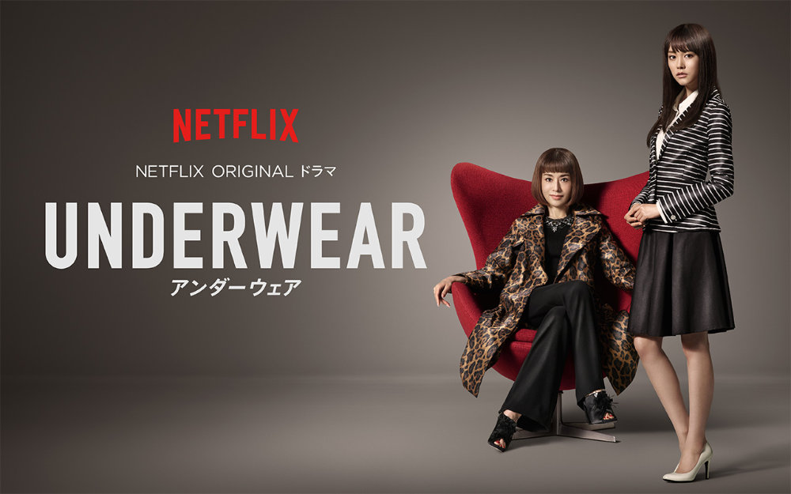

## A Fantastic, New Japanese Netflix TV Show

From time to time – but not very often – a TV Show gets released, which surprises me. This happened last time in 2007 with _Pushing Daisies_, where I loved everything: the story, the actors, the sets, every dialog. And now it happened again. I have a new favorite TV Show: [Underwear](http://www.imdb.com/title/tt4790548/) (_Underwear_).

**Underwear** (アンダーウェア) or Atelier, is a mini-television series produced by **Netflix** and **Fuji TV**. You can add it to your watchlist on Netflix [here](https://www.netflix.com/title/80067618) or [watch a Trailer on YouTube](https://youtu.be/CSnj2J6aVmI).

It’s a story about a young girl called **Mayuko** (**Mirei Kiritani**), coming from a small town, who finished her studies in fabric design at the university and starts her first job at an exclusive custom tailoring lingerie store called **Emotion** in Ginza, Tokyo. It’s a small shop with a few designers, some salesmen, and the owner of the workshop, who is a woman in her 50s (**Mao Daichi**), an honorary named _Shachou_ (President) by her employees.

The _Atelier_, a french word for a **workshop** or **studio**, a place, where professional artists work together and produce pieces of art, has multiple rooms, separated by doors, leading from the entrance hall, where customers get served, to the inner rooms of the owner. Additionally, it has a cellar with tons of fabric, accessories, and documents.

The **13 episodes** provide a deep insight into Japanese culture, politeness, art, craft, and beauty. Every scene is choreographed with an eye to the detail. The **camera work** is really interesting and uses a variety of techniques. The **actors** are brilliant. It is a pleasure to follow the Japanese **dialogs** (subtitled), which can tell so much with so few words. Japanese is a language of _context_ and _nuances_.

Every episode has at least **one core scene**, which transports a message or philosophy accompanied by beautiful music.

The **soundtrack** was composed by [Timothy Michael Wynn](http://timwynn.net/) and I can’t wait for its release in 2016.

I was surprised by this brilliant Japanese TV show and finished it in less than a week and I’ll surely watch again. I highly recommend watching it!
