## Design

I have to admit that even though I’m a Frontend Developer, designing is the thing I enjoy most. The reason I became a developer is that as a designer without any coding skills all your ideas stay exactly that, ideas, unless another developer brings them to life.

The good thing with a personal project is there are no limitations and you’re the customer. No compromises that water down an idea, no real-world boundaries that prevent doing everything as it should be done.

When I started working on my website I wanted to do the project as it should be done, and that means, you start with the content.

## Content First

I preached this for years to my customers when they hired me to create a website for them: **Content is King**. Without content, you don’t have anything. _Lorem ipsum_ placeholder text is a bad idea. You need to know your content to design it. I always cursed when a customer said: <q>You can start designing, we send the text and photos later</q>. These websites _always_ ended in a bad product.

In 2018, I created nearly all text for my website. It took long hours to hone down the text until it was short enough, content-rich, and precise in its meaning. I write all my texts with [iA Writer](https://ia.net/writer), because of the minimal interface, focus-mode, Markdown support, and a lot of other features for writing.

I hadn’t written articles for a long time and wanted to change that. In 2019 I started again regularly to create content for my website. I introduced the new format of a monthly blog post listing my favorite links, videos, movies, or books of the month.

After all the political clash and problems with censorship and policing content creators on the major social media websites, I decided that a website is a best and future-proof investment into a _living_ and _diverse_ internet.

[Medium](https://medium.com/) is not your website, it’s another persons’ website. Everything you write on Medium or elsewhere on Social Media platforms is not yours—sometimes even written bluntly in legal small-print—and can be taken down, censored, or banned if somebody disagrees.

The internet can survive if we move it back to the people and invest in decentralization: Your website instead of Medium, your news list instead of your followers, an [RSS feed](/index.xml) instead of a stream of content, [Mastodon](https://mastodon.social/@kogakure) instead of Twitter, [Matrix](https://matrix.to/#/@kogakure:matrix.org) instead of WhatsApp.

Everything controlled by a company can (and probably _will_) get corrupt, disappear, or be changed at any time without you being able to do anything about it. Your livelihood might disappear overnight because YouTube decides to rank the algorithm differently.

I’ll continue to use social media to extend my reach, but I moved my content back to _my_ platform.

## Typography

The next thing I moved my attention to was Typography. I always loved Typography and have many books on the topic, including the famous [The Elements of Typographic Style](https://www.goodreads.com/book/show/44735.The_Elements_of_Typographic_Style) by _Robert Bringhurst_. There is a shorter, free version available tailored to the usage of typography on websites: [The Elements of Typographic Style Applied to the Web](http://webtypography.net/).

I even own a copy of the 650 pages strong [Decode Unicode](https://www.goodreads.com/book/show/17186505-decodeunicode), a book listing all 137,374 typographical characters, from the Armenian capital letter _Ayb_ to the Khmer Letter _Ka_. There is even a [complete website](https://decodeunicode.org/) showing all characters and a [two and a half-hour long movie](https://vimeo.com/48858289) showing all characters.

<Row variant="variable" minWidth="110px" marginBottom>
  <AmazonBook asin="0881792128" size="large" />
  <AmazonBook asin="3874398137" size="large" />
</Row>

### Typeface

I looked long into free options of good looking and well-designed typefaces. I didn’t want to include a paid font, that needs constant payment and an external server because they load slow and tracking is nearly always included.

After long consideration, I picked the beautiful [Playfair Display](https://github.com/clauseggers/Playfair-Display) by [Claus Eggers Sørensen](https://forthehearts.net/). It’s available from regular to black weights. It was converted to a variable font in 2019 (but I didn’t find a use case for that yet).

I like in particular the italic font with the beautiful loops and curves. I picked its companion _Playfair Display SC_ for small caps, used in abbreviations and acronyms.

### Scale

Next, I picked a Typographic Scale. A scale is a way to pick font sizes based on a fixed set of rules, for example, a specific harmonic number or formula to create a harmonic visual image. I decided to go with the [golden section](https://www.modularscale.com/?1&em&1.618) (ratio 1:1.618).

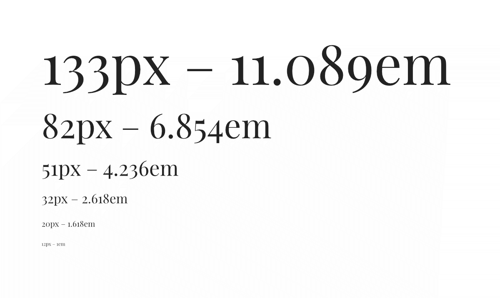

I picked 20 Pixel as the base font size. I’m in my forties and websites pick fonts way too small. The company iA Inc. wrote in 2006 the article [The 100% Easy-2-Read Standard](https://ia.net/topics/100e2r), but still, fonts below the recommended 16 Pixels of browsers are a standard.

### Ligatures and Other Gems

_Playfair Display_ has a few beautiful ligatures—when two letters as `fi` get combined in one beautiful combined letter: fi—which look fantastic on large headlines.

I decided to go for [hanging punctuation](http://webtypography.net/2.3.3) on block quotes and lists, where the quotation mark or bullet list item is moved into the marginalia. This creates a much more harmonious image of the text than using regular punctuation. And as in my previous website, I created the quotes with CSS, fitting to the language of the quote, including sub quotations.

However, I made a huge mistake while creating the font and repeated the mistake on the grid (more on that later) which took later in the development time to correct: I didn’t think about the responsiveness of the web. I was clear of creating a responsive website, but I didn’t think that a fixed size-scale might _not_ work with a responsive website without adding dozens of media queries. That’s why I started designing with a fixed size scale and moved later to fluid typography.

At that early stage, I had thought of a substitution font while loading the web font or if web fonts are disabled. I selected _Georgia_ because it has a similar size, width, and character.

## Color

I wanted my website to have the color of Japanese _Washi_ (和紙) paper. Early on I knew that I would support a dark and a light theme. I tried to limit myself to very few colors: One **accent** color, **background** color, and **foreground** color. Additionally, I created variations of these with different intensity.

### HSL Color Space

I picket the HSL color space, to be able to quickly create variations of my colors. In HSL the first value **H** stands for Hue. Red is 0° and then each color is represented by a value on a circle. The **S** stands for Saturation and is a value between 0 % (grey) and 100 % (full saturation). The **L** stands for Lightness and is a value between 0 % (black) and 100 % (white). With all three values, I was able to create the colors I wanted: First I picked the color hue I wanted to go for. Next, I reduced the Saturation to a value below or around 10% which I found made any color instantly look _Shibui_ (one of its identifying features is desaturated colors). To get all the other colors I moved the Lightness value down for a dark color or up for a light color.

<Row variant="variable" minWidth="9rem" marginBottom>
  <ColorSwatch color="hsl(40,7%,90%)" name="Light Background" />
  <ColorSwatch color="hsl(40,7%,5%)" name="Light Foreground" />
  <ColorSwatch
    color="hsl(357,96%,46%)"
    name="Accent"
    description="Used for Link hover styles"
  />
</Row>

<Row variant="variable" minWidth="9rem" marginBottom>
  <ColorSwatch color="hsl(40,7%,10%)" name="Light Background" />
  <ColorSwatch
    color="hsl(40,7%,90%)"
    name="Light Foreground"
    description="Value has opacity of 0.87"
  />
  <ColorSwatch
    color="hsl(357,96%,46%)"
    name="Accent"
    description="Used for Link hover styles"
  />
</Row>

---

### Color Themes

Additionally to the main colors, I created 3 other color themes: A green one for my Haiku page, a brown one, I wanted to use for my Sketchnotes page, and a blue one I wanted to use on my projects page (but didn’t do it).

#### Green

<Row variant="variable" minWidth="9rem" marginBottom>
  <ColorSwatch color="hsl(65,5%,50%)" name="Light Green Background" />
  <ColorSwatch color="hsl(65,5%,5%)" name="Light Green Foreground" />
  <ColorSwatch
    color="hsl(65,5%,30%)"
    name="Accent"
    description="Used for Link hover styles"
  />
</Row>

<Row variant="variable" minWidth="9rem" marginBottom>
  <ColorSwatch color="hsl(65,5%,20%)" name="Dark Green Background" />
  <ColorSwatch
    color="hsl(65,5%,90%)"
    name="Dark Green Foreground"
    description="Value has opacity of 0.87"
  />
  <ColorSwatch
    color="hsl(65,5%,30%)"
    name="Accent"
    description="Used for Link hover styles"
  />
</Row>

---

#### Brown

<Row variant="variable" minWidth="9rem" marginBottom>
  <ColorSwatch color="hsl(38,10%,55%)" name="Light Brown Background" />
  <ColorSwatch color="hsl(38,10%,5%)" name="Light Brown Foreground" />
  <ColorSwatch
    color="hsl(38,10%,30%)"
    name="Accent"
    description="Used for Link hover styles"
  />
</Row>

<Row variant="variable" minWidth="9rem" marginBottom>
  <ColorSwatch color="hsl(38,10%,20%)" name="Dark Brown Background" />
  <ColorSwatch
    color="hsl(38,10%,90%)"
    name="Dark Brown Foreground"
    description="Value has opacity of 0.87"
  />
  <ColorSwatch
    color="hsl(38,10%,30%)"
    name="Accent"
    description="Used for Link hover styles"
  />
</Row>

---

#### Blue

<Row variant="variable" minWidth="9rem" marginBottom>
  <ColorSwatch color="hsl(220,6%,50%)" name="Light Blue Background" />
  <ColorSwatch color="hsl(220,6%,5%)" name="Light Blue Foreground" />
  <ColorSwatch
    color="hsl(220,6%,30%)"
    name="Accent"
    description="Used for Link hover styles"
  />
</Row>

<Row variant="variable" minWidth="9rem" marginBottom>
  <ColorSwatch color="hsl(220,6%,20%)" name="Dark Blue Background" />
  <ColorSwatch
    color="hsl(220,6%,90%)"
    name="Dark Blue Foreground"
    description="Value has opacity of 0.87"
  />
  <ColorSwatch
    color="hsl(220,6%,30%)"
    name="Accent"
    description="Used for Link hover styles"
  />
</Row>

---

I didn’t _just_ invert colors but needed to make sure to create good contrast which is why I handpicked dark and light colors by hand. I needed to make another adjustment after I launched my website I didn’t anticipate: The white text on the dark background was way too bright. This is a known problem and there are multiple solutions to fix this. You can pick a lighter font on dark—which I didn’t want to do because of the file size of additional font weights—or reduce the opacity. I picked for all light text on dark an opacity of `0.87`.

## Logo

Next, I moved my focus to the logo. A logo is always a difficult topic. Do I need one? Why? What should it be? My initials? An image? It’s easy to create a cheesy logo. I used a _rakkan_ (落款), a Japanese artist seal, for at least 10 years. An artist carved it for me into stone, using the oldest Chinese font, the _small seal script_, introduced by the Chinese Emperor _Qin Shi Huang_ 2200 years ago. It gets pressed into red ink and then applied to the artwork as the signature. I choose the characters of my internet pseudonym _kogakure_ (木隠), meaning “hidden behind leaves”.

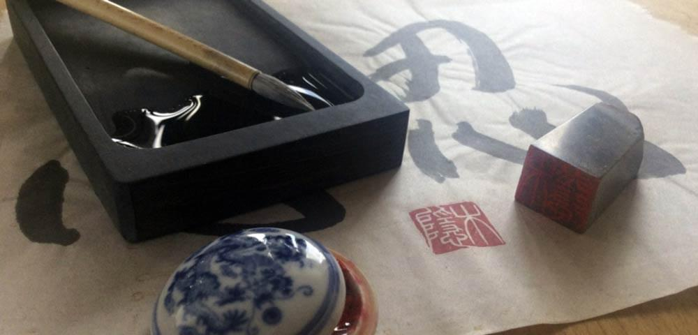

I created a few sketches of other possible logos, but in the end, I discarded them all and moved back to my _rakkan_. I decided to simplify the vector form and reduce the number of points and make it more performant and easier to recognize in smaller sizes.

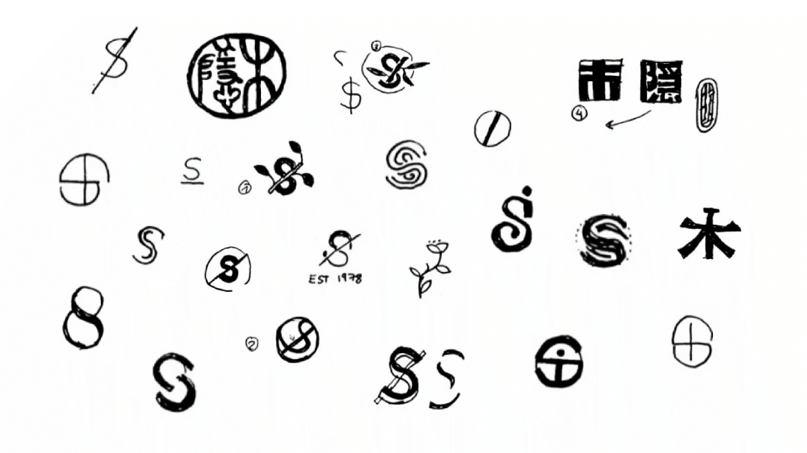

But after finishing the logo I decided in the interest of simplicity and austerity that there is no reason to use a logo at all. I even removed my name from the header, as it’s obvious on what website the visitor is. My name is written enough around the site. The logo will appear in parts of the website, for example as an icon for the app or on other locations a logo fits.

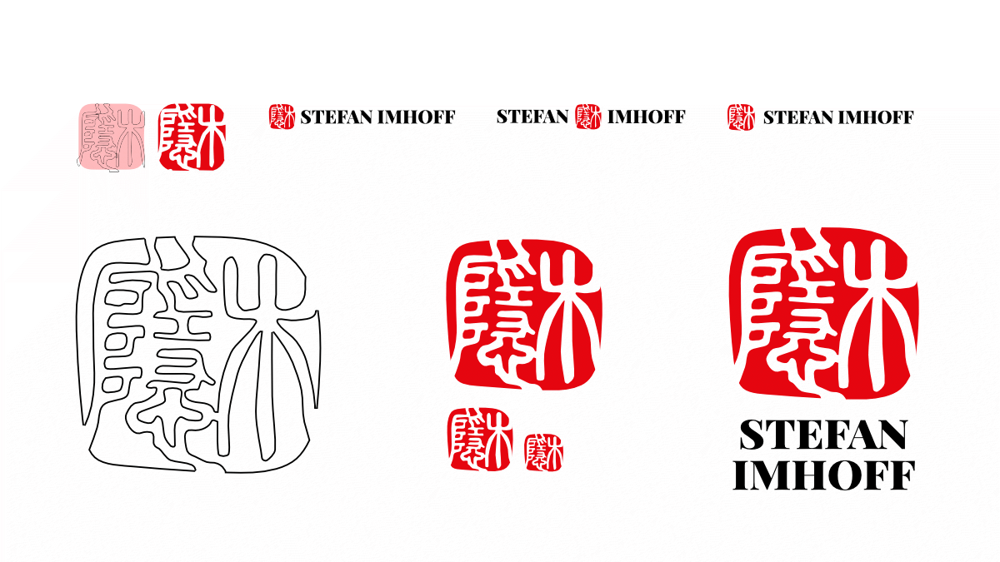

## Grid

Early on I got obsessed with the [Golden Canon Grid](https://youtu.be/fWfD0EfiXcE) and my early designs used a complicated and sophisticated version of it.

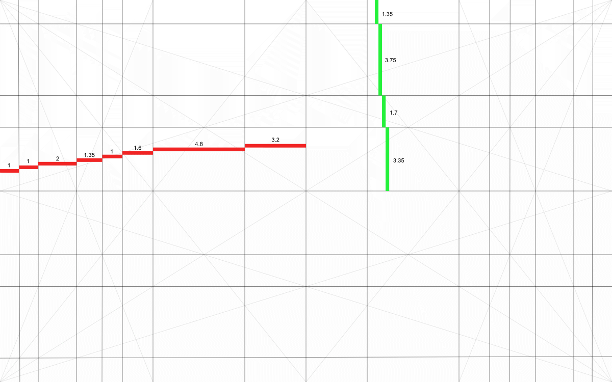

But gradually I decided this would end in a nightmare when moving to code and migrated to a modular grid. But I didn’t recognize my error of using a fixed size module for the grid—an error I had to correct later.

I was sure to use the CSS Grid Layout, correctly named [CSS Grid Module Level 1](https://www.w3.org/TR/css-grid-1/). Web developers like [Rachel Andrew](https://gridbyexample.com/) or [Jen Simmons](https://labs.jensimmons.com/) showed since the introduction of the CSS Grid what cool things are possible.

I used a little bit of the CSS Grid on the last redesign of my [martial arts website](https://www.kogakure.de/). But nothing compared to the grid I used this time.

Unfortunately, the [subgrid feature](https://caniuse.com/#feat=css-subgrid) is not yet implemented in any browser other than Firefox (as of mid-2020). That’s why I needed to recreated my grid inside of grid containers to align content to its parents' grid.

## Icons

I decided to use icons sparingly and not to invest the time creating my own, because with [Remix Icon](https://remixicon.com/) I found a beautiful, free, minimal icon system. I even created a few icon wishes for Remix Icon early on, to get icons I thought I might need later (which I didn’t).

I started my designs using a social media bar sitting in the lower-left corner. But as time moved on I found that the services I picked changed in the importance and they were not important enough to justify a constant icon in the corner. The social bar had to go.

Subtle arrows and icons for specific use cases were left. I removed complex sun and moon icons for the light and dark theme switcher in favor of a simple circle.

## User Interface Design

In mid of 2019, I finally started with my design. I spend 3 hours on prototyping and mood boards and nearly 25 hours on the designs.

As my tool of choice, I picked [Affinity Designer](https://affinity.serif.com/designer/). I love the tool since it was first released. I worked for 15 years with Adobes products and owned multiple expensive versions of their designer software. But when Adobe thought it might be a good idea to rent software instead of selling it and forcing people to regularly pay to be able to use the tools, I moved on to other software.

And working with [Affinity Designer](https://affinity.serif.com/designer/), [Affinity Photo](https://affinity.serif.com/photo/), or [Affinity Publisher](https://affinity.serif.com/publisher/) is much more fun. They are performant and have many nice tools and features. And the price is unbeatable. I own all their products on Mac and iPad and can move between the tools, while designing, with ease.

I decided to use [Aaron James Draplins](http://www.draplin.com/) method of designing. He is a talented designer inspiring millions with his artwork and author of <AffiliateLink asin="1419720171">Draplin Design Co.: Pretty Much Everything</AffiliateLink>.

<Row variant="variable" marginBottom>
  <AmazonBook asin="1419720171" size="large" />
</Row>

As he shows in the fantastic free video [Aaron Draplin Takes On a Logo Design Challenge](https://youtu.be/zOPA0NaeTBk), he starts in the middle with an idea and then duplicates the whole version and iterates on it. If he reaches a dead end he moves back to the last junction and moves from there to another direction. In the end, he has one huge board with dozens of variants and ideas, none of them worked into good craftsmanship or details, but keeps everything loose and ungrouped to be able to manipulate the individual pieces.

I followed this technique on all my designs and created dozens of variations, sometimes whole pages, sometimes a small detail as the footer or a meta section.

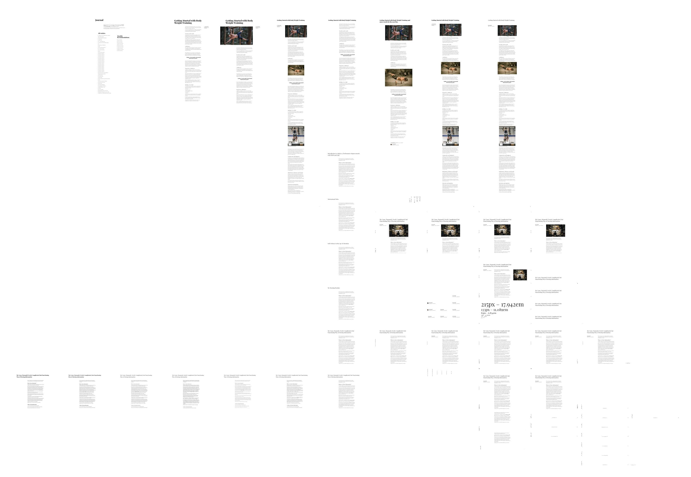

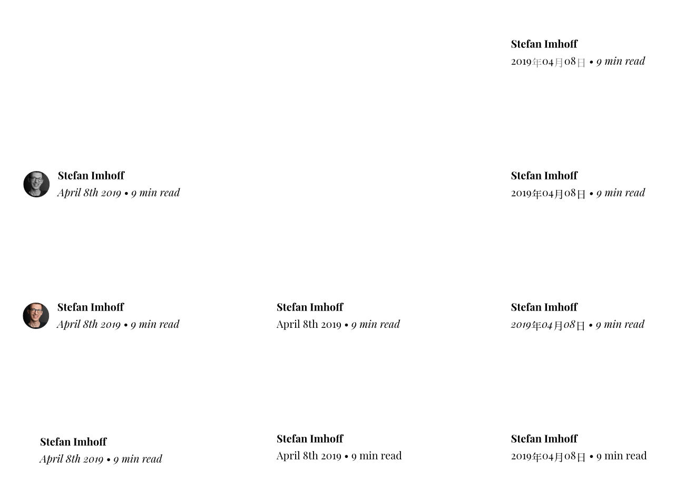

Designing was the part that made the most fun to me. Designing is like a concert: It starts with a cello, but then more and more instruments get added until the whole [concert ends in a huge crescendo](https://youtu.be/XpT-92HS11I). The start is always the hardest with the designer staring at a blank white screen. But then things fall into the place and ideas multiply and in the end, everything seems obvious and the next screen is easy to create.

I started designing the blog detail page headline and moved out from there, creating text, header, footer, and small details.

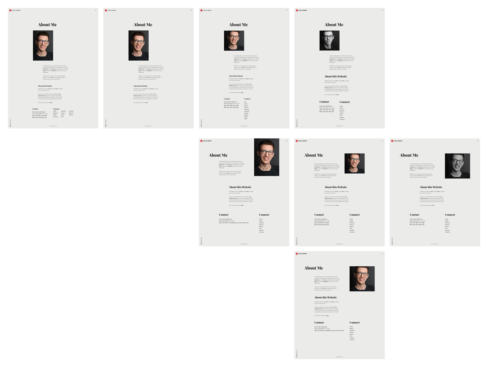

Then I moved into color variations for the pages. I designed error pages, navigations, special pages, and the homepage last. I didn’t design every detail but quickly moved from idea to idea, leaving behind a mess of unnamed layers and incomplete or outdated ideas.

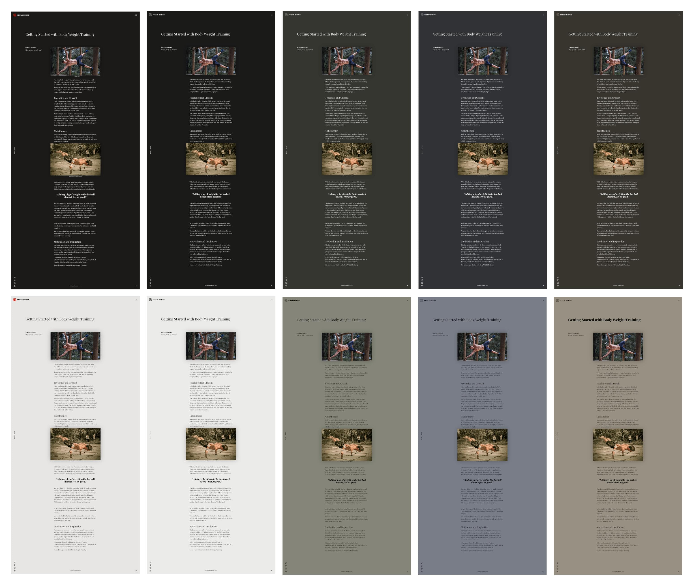

I created a huge design for all layout variations I wanted to support in a page (e.g. the combination of an image and a text). I moved quickly to [CodePen](https://codepen.io/) to create prototypes for these variations to validate my ideas where feasible. You can see all my prototypes on my CodePen account.

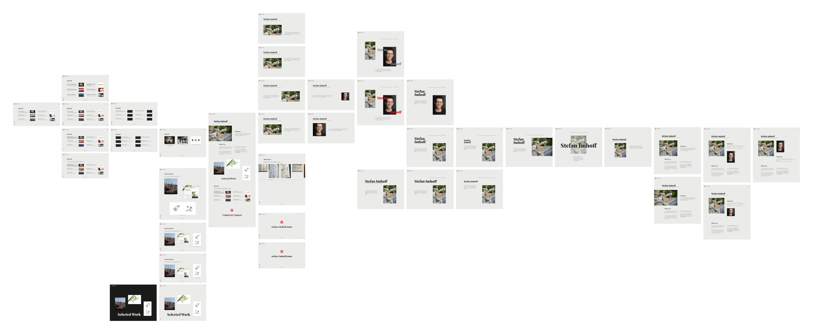

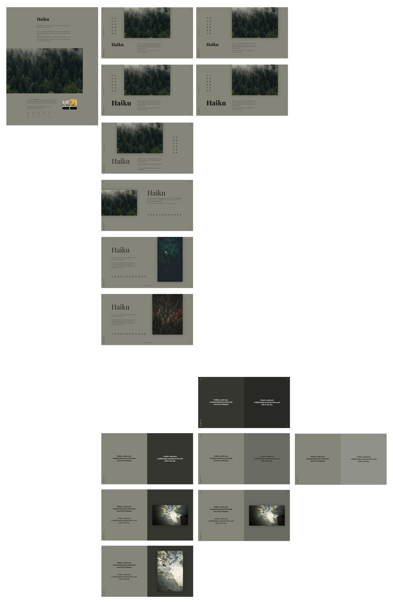

In the fall 2019, I finished my design and left it for a few weeks untouched to see if I start disliking it. On the 25th of November 2019, I finally started with coding.

---

This is the second of _three_ parts in a series of articles about the process of creating my new website.

- <TextLink to="/new-website-2020-inspiration/">Inspiration</TextLink>
- **Design**
- <TextLink to="/new-website-2020-development/">Development</TextLink>
